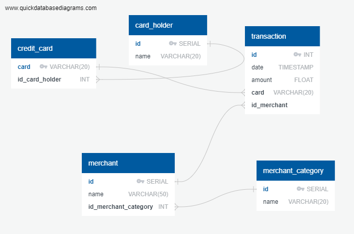

# Detecção de Fraudes com SQL

## Introdução 

A fraude financeira é uma preocupação crescente, e empresas de diversos setores dependem de analistas de dados para identificar padrões de transações incomuns que possam indicar atividades fraudulentas. Neste projeto avançado de SQL, você assumirá o papel de um analista de fraudes e criará um banco de dados para detectar transações suspeitas com cartão de crédito usando dados históricos. Com a ajuda de SQL, você explorará padrões de comportamento, descobrirá anomalias e relatará casos potencialmente fraudulentos, oferecendo valor prático em setores como fintech, bancos e comércio eletrônico.

### Conjunto de dados

Utilize este conjunto de dados de transações com cartão de crédito. Ele inclui dados de transações anonimizados, como valor, data e hora, estabelecimento comercial e rótulos de fraude, perfeito para desenvolver lógica de detecção de fraudes. você deverá simular a construção de um banco de dados transacional utilizando o Databricks. Após a criação e o preenchimento das tabelas com os arquivos CSV's, você terá que utilizar a linguagem SQL para analisar os dados e responder algumas perguntas.

### Modelagem de dados

